# Wazuh on Docker — Technical Report

## Executive Summary
This report documents deploying Wazuh (indexer, manager, dashboard) via Docker Compose on a Windows machine, then installing a Wazuh agent directly on that same host so its own security events are collected, analyzed, and visualized in the Wazuh dashboard in near real time. It covers the full setup, three real issues hit along the way, and live confirmation that the pipeline works end to end.

**Environment:** Windows 11 Pro, Docker Desktop, PowerShell (Administrator, for agent installation steps).

## Project Overview

### Purpose
Stand up a self-monitoring security pipeline: Wazuh's backend running in Docker, watching the very machine it's running on via a natively installed agent.

### Key Steps
1. Clone the Wazuh Docker repository
2. Generate TLS certificates for inter-component communication
3. Start the full Wazuh stack
4. Log into the dashboard
5. Install and enroll the Windows agent
6. Confirm the agent is reporting
7. Watch live events triggered by a real action

## Technical Implementation

### 1. Prerequisites
Git for Windows was installed via `winget install --id Git.Git -e --source winget`. Docker readiness was confirmed with `docker --version` and `docker compose version`.

### 2. Clone the Wazuh Docker Repository
```powershell
cd $env:USERPROFILE\Documents
git clone https://github.com/wazuh/wazuh-docker.git -b v4.11.2
cd wazuh-docker\single-node
```
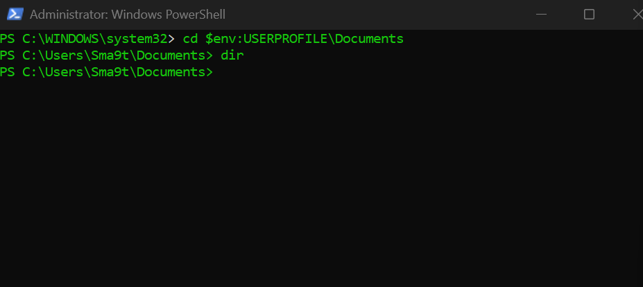
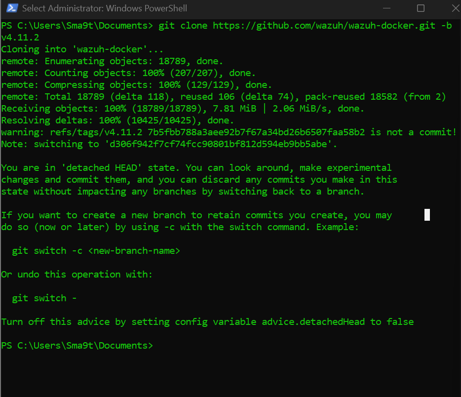
*Pinning to `v4.11.2` guarantees a reproducible setup regardless of newer releases.*

**Known Issue — detached HEAD on clone:** cloning with `-b v4.11.2` triggers `warning: refs/tags/v4.11.2 ... is not a commit!` and switches into a detached HEAD state. This is harmless — it's just Git checking out a tag rather than a branch — but worth knowing so it doesn't look like something went wrong.

```powershell
dir
```
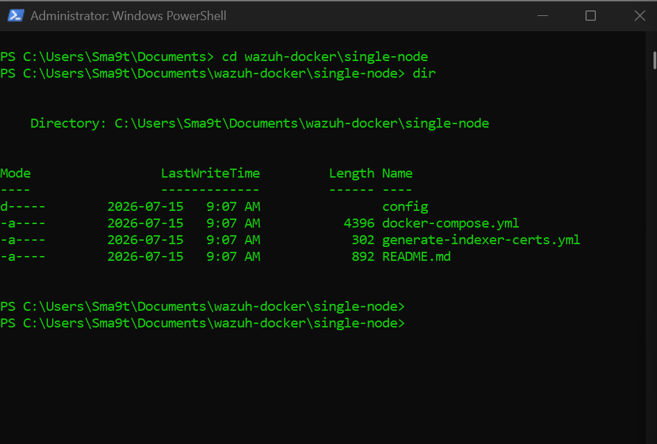
*Confirms `docker-compose.yml`, `generate-indexer-certs.yml`, and `config` are present.*

### 3. Generate TLS Certificates
Wazuh's components communicate over TLS, so certificates need to be generated before first start:
```powershell
docker compose -f generate-indexer-certs.yml run --rm generator
```
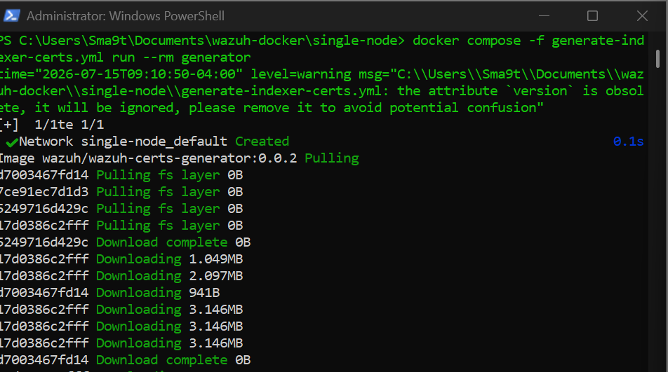
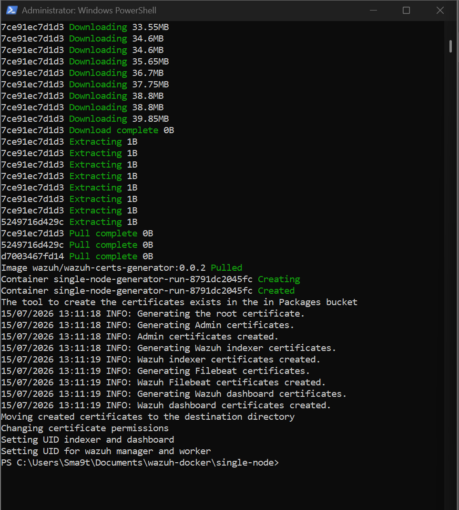

**Known Issue — obsolete `version` attribute:** Docker Compose warns `the attribute 'version' is obsolete, it will be ignored` on every run. This is just a deprecation notice from the compose file itself — safe to ignore, no functional impact.

Verified with:
```powershell
dir config\wazuh_indexer_ssl_certs
```
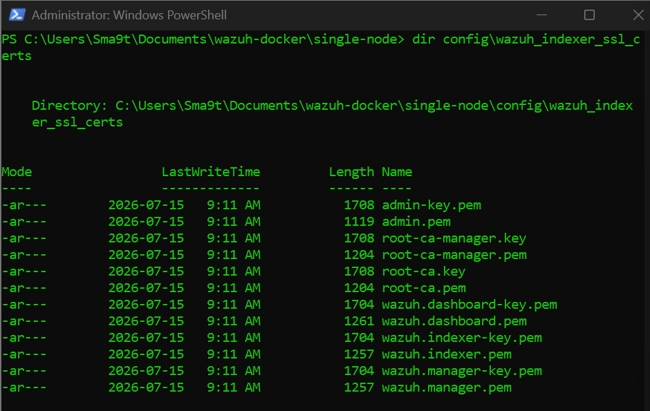
*Root CA, admin cert/key, and per-node certs all present, as expected.*

### 4. Start the Full Wazuh Stack
```powershell
docker compose up -d
```
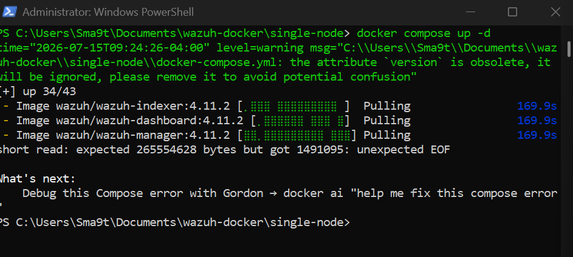
*First attempt failed partway through pulling the indexer/manager/dashboard images with `short read: expected 265554628 bytes but got 1491095: unexpected EOF` — a network interruption, not a configuration problem.*

Simply retrying resolved it, since Docker caches layers already downloaded:
```powershell
docker compose up -d
```
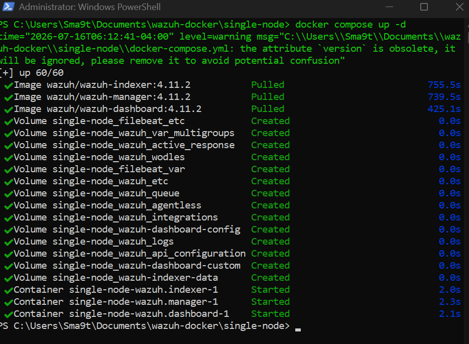
*All three images pulled and all three containers started successfully on retry.*

Confirmed healthy with:
```powershell
docker compose ps
```
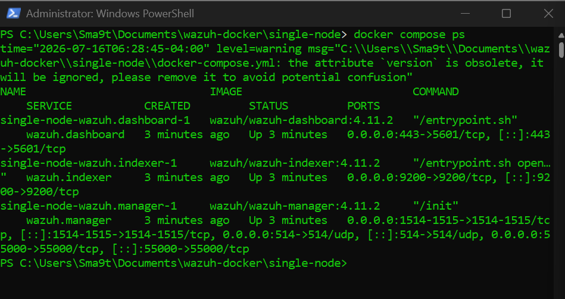
*`wazuh.indexer`, `wazuh.manager`, and `wazuh.dashboard` all showing `Up`, with expected port mappings (443, 9200, 1514/1515, 514, 55000).*

### 5. Log Into the Wazuh Dashboard
Navigated to `https://localhost` — the browser flags the connection as "Not secure" because Wazuh uses a self-signed certificate by default, which is expected for a local deployment.
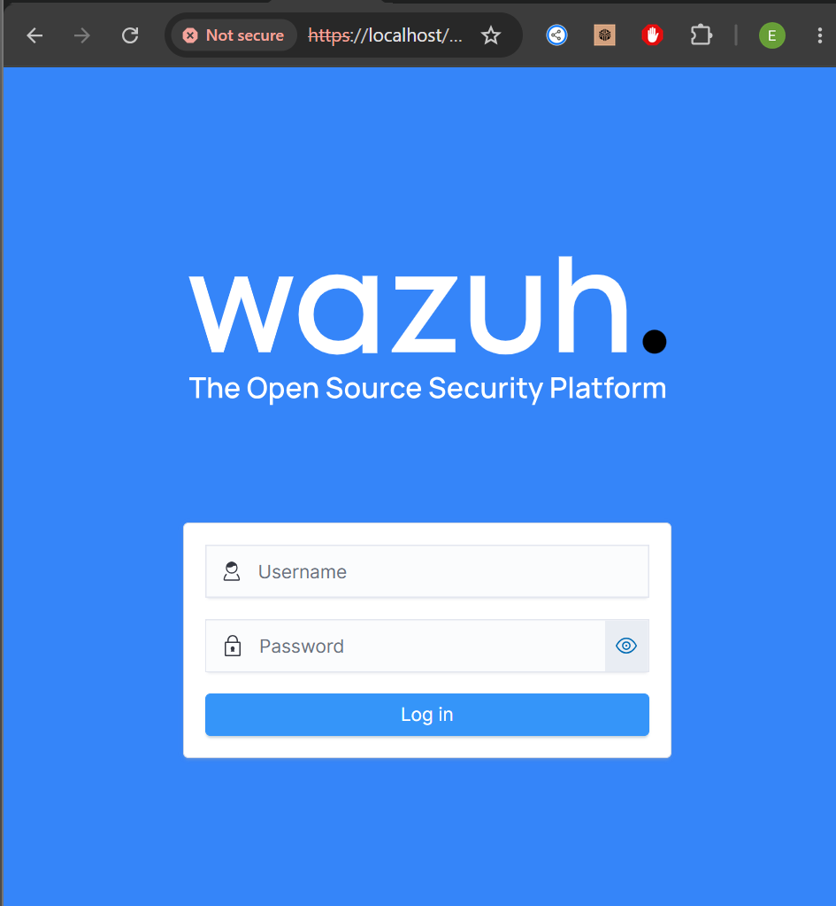

Logged in with the default credentials (`admin`/`admin`):
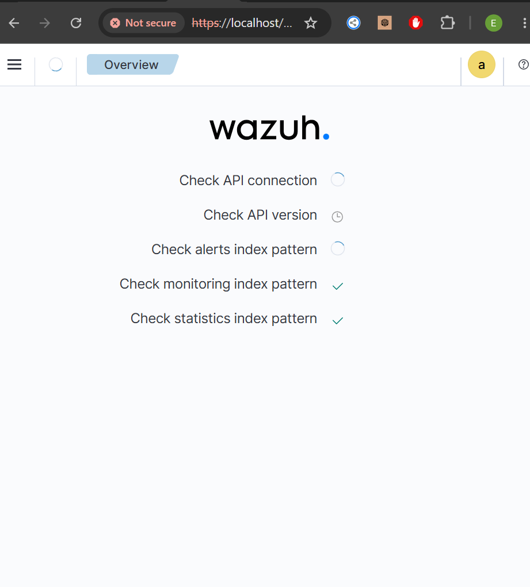
*Initial health checks (API connection, index patterns) passing.*

### 6. Install the Wazuh Agent on the Windows Host
The agent installer was downloaded and installed with:
```powershell
msiexec /i wazuh-agent.msi /qn WAZUH_MANAGER="127.0.0.1" WAZUH_AGENT_NAME="Sma9t" /l*v install_log.txt
NET START WazuhSvc
```

**Known Issue — service starts then immediately stops:** the first start attempt reported success but the service showed `Stopped` right after. The agent's own log revealed the real cause — an invalid placeholder manager address (`0.0.0.0`) in `ossec.conf`:
```
ERROR: (4112): Invalid server address found: '0.0.0.0'
ERROR: (1215): No client configured. Exiting.
```

**Fix:** the config file's `<client><server><address>` field was corrected to `127.0.0.1`, then the service was restarted:
```powershell
notepad "C:\Program Files (x86)\ossec-agent\ossec.conf"
NET STOP WazuhSvc
NET START WazuhSvc
Get-Service | Where-Object {$_.Name -like "*wazuh*"}
Get-Content "C:\Program Files (x86)\ossec-agent\ossec.log" -Tail 15
```
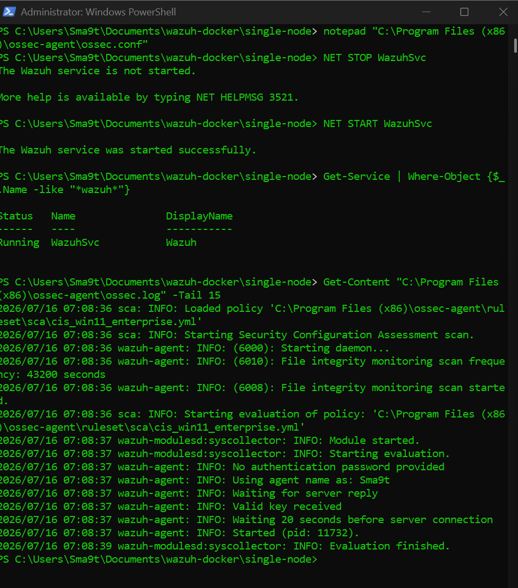
*Service status shows `Running`; the log confirms `Using agent name as: Sma9t`, `Waiting for server reply`, and `Valid key received` — the agent successfully enrolled with the manager.*

### 7. Confirm the Agent Appears in the Dashboard
Menu → **Endpoints** → **Summary**:
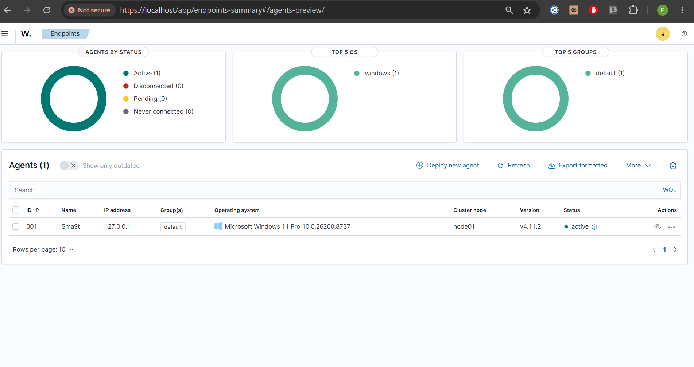
*Agent registered as `Sma9t`, IP `127.0.0.1`, OS correctly identified as Microsoft Windows 11 Pro, version `v4.11.2` matching the manager, status **active**.*

### 8. Watch Live Events
With the Events view open and filtered to this agent, a real logoff/logon was triggered on the Windows host (`Windows key + L`, then logging back in):

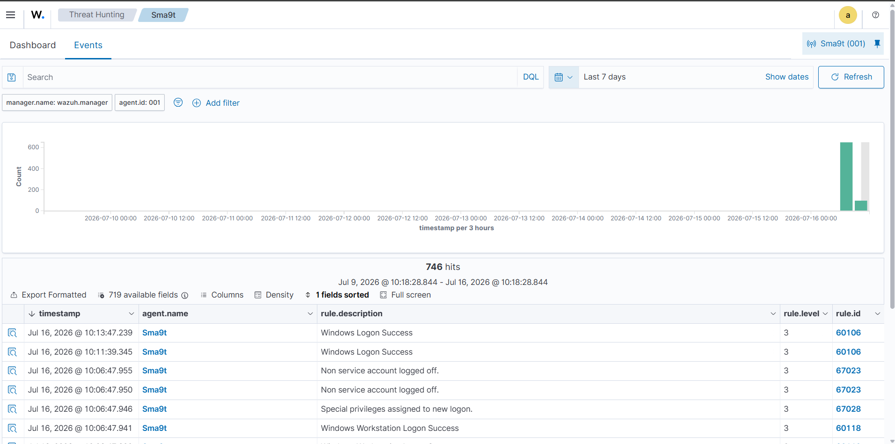
*746 hits across the monitoring window, with a clear spike matching the day's activity.*

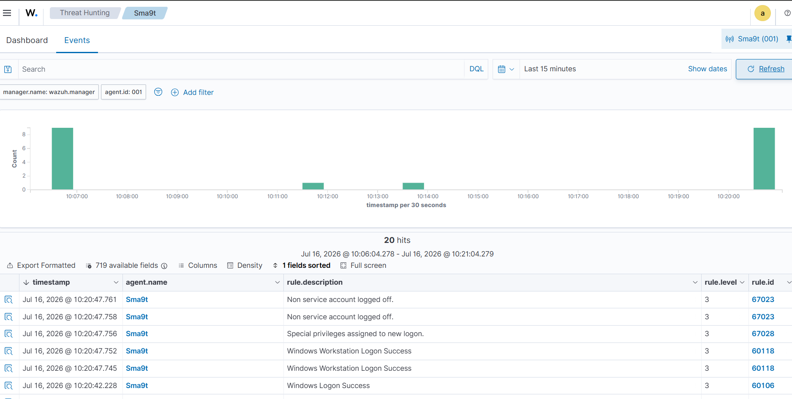
*Narrowed to the last 15 minutes: 20 hits appear almost immediately after the lock/unlock action, including `Windows Workstation Logon Success`, `Windows Logon Success`, `Special privileges assigned to new logon`, and `Non service account logged off` — direct evidence the pipeline works end to end, live.*

## Findings
- The full Wazuh stack (indexer, manager, dashboard) deployed successfully via Docker Compose on Windows, after one retry due to a network interruption during image pull — not a configuration issue.
- The Windows agent registered and reported to the manager under the name `Sma9t`, confirmed in both the agent log (`Using agent name as: Sma9t`) and the dashboard's Endpoints summary.
- The most common agent enrollment failure in this walkthrough was a leftover placeholder address (`0.0.0.0`) in `ossec.conf`, which prevented the service from staying running — manually correcting the manager address resolved it immediately.
- End-to-end monitoring was confirmed live: a real logon/logoff action on the Windows host appeared in the dashboard within moments, correctly classified across four distinct rule types.

## Risks & Mitigation

| Risk Observed | Why It Matters | Mitigation |
|---|---|---|
| Dashboard accessed with default credentials (`admin`/`admin`) | Trivial to compromise if ever exposed beyond localhost | Change default credentials immediately in any deployment beyond a local lab |
| Self-signed TLS certificate on the dashboard | Browsers correctly flag it as untrusted; fine for local use but not acceptable for real deployments | Replace with a properly signed certificate before any production or shared use |
| Agent enrollment silently failed with a bad default config value (`0.0.0.0`) | Could easily be mistaken for a "the agent just doesn't work" dead end without checking logs | Always check `ossec.log` first when a Wazuh service issue isn't self-explanatory from `Get-Service` alone |
| Manager reachable at `127.0.0.1` only in this setup | Fine for a single-host lab; wouldn't scale to monitoring other machines without exposing the manager on the network | For multi-host monitoring, the manager would need a real reachable address and properly firewalled ports |

## Conclusion
This lab successfully validated a full Wazuh deployment on Windows, from Docker Compose setup through live security event monitoring. Two of the three issues hit along the way (the interrupted image pull, the detached HEAD warning) were transient and resolved themselves or required no action; the third (the agent's invalid default manager address) required reading the actual agent log rather than trusting the surface-level service status. The clearest proof of success was watching a real, self-triggered Windows logon appear in the dashboard within moments — confirming the entire pipeline, from Windows Security Event Log to Docker-hosted manager to browser dashboard, works as intended.
